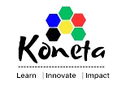
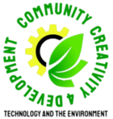

# #EcoTechRevolution
#EcoTechRevolution is a collaborative media based project between Koneta Hub and Creative Community 4 Development (CC4D) focusing on E-waste Management and Media Skills for young people in South Sudan and Uganda.

This collaborative project is made possible by the Access to Skills & Knowledge Network (#ASKnet) with generous funding and support from the r0g_agency (Berlin) and the Federal Ministry of Economic Cooperation and Development (BMZ) (Germany)

## Project Implementing Partners 
| Koneta Hub| CC4D |
| :--------:| :--------: |
|||

## Project Supporters & Funders
| r0g Agency | #ASKnet  | BMZ |
:--------: | :----: | :-------: |
 ||  | [Official Website](https://openculture.agency/) | [Official Website](https://github.com/ASKnet-Open-Training) | [Official Website](https://www.bmz.de/en/) |

This repository is an Open Education Resource that serves to help people anywhere to teach Media Skills with a focus on E-Waste Management and stage their own #EcoTechRevolution